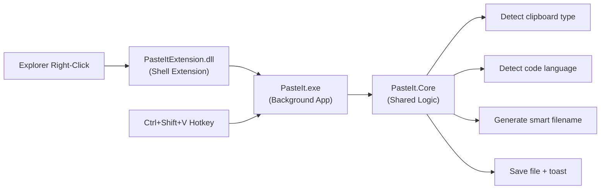

# PasteIt — Clipboard-to-File Tool

A tool that lets you instantly save clipboard content (images, text, code, URLs) as properly-typed files — directly from Explorer's right-click menu or a keyboard shortcut. No dialogs, no extra apps, no friction.

## User Review Required

> [!IMPORTANT]
> **Project location:** This plan creates a new project at `c:\Users\cricc\PasteIt\`. Confirm this is acceptable, or suggest a different path.

> [!IMPORTANT]
> **Hotkey choice:** The plan uses `Ctrl+Shift+V` as the default hotkey (only active when Explorer is focused). If you'd prefer a different combo (e.g. `Win+Alt+V` like PasteIntoFile uses), let me know.

> [!WARNING]
> **Shell extension registration requires admin rights.** During development, we'll use `regasm` to manually register/unregister. For distribution, an installer (Wix) would handle this. The background app does NOT require admin.

---

## Architecture

Modeled after [FileConverter](file:///c:/Users/cricc/FileConverter)'s proven pattern:



| Component | Type | Responsibility |
|---|---|---|
| **PasteIt.Core** | Class Library (.NET 4.8) | Clipboard reading, type detection, code language detection, file saving |
| **PasteItExtension** | Class Library (.NET 4.8) | Shell extension DLL — context menu item via SharpShell |
| **PasteIt** | WinExe (.NET 4.8) | Invisible background app — hotkey listener, auto-start, toast |

> [!NOTE]
> Using .NET Framework 4.8 (same as FileConverter) because SharpShell shell extensions require it. COM interop with .NET 8+ is possible but significantly more complex with no real benefit here.

---

## Proposed Changes

### PasteIt.Core — Shared Logic

#### [NEW] [ClipboardDetector.cs](file:///c:/Users/cricc/PasteIt/PasteIt.Core/ClipboardDetector.cs)

Reads the Windows clipboard and determines content type:

| Clipboard Format | Detected Type | Saved As |
|---|---|---|
| `CF_BITMAP` / `CF_DIB` | Image | `.png` |
| `CF_HDROP` (files) | Skip | Already a file — no action |
| `CF_UNICODETEXT` with code patterns | Code | `.py`, `.js`, `.cs`, etc. |
| `CF_UNICODETEXT` with URL pattern | URL | `.url` |
| `CF_UNICODETEXT` plain | Text | `.txt` |
| `CF_HTML` | HTML | `.html` |

#### [NEW] [CodeLanguageDetector.cs](file:///c:/Users/cricc/PasteIt/PasteIt.Core/CodeLanguageDetector.cs)

Heuristic-based code language detection using pattern matching:

| Pattern | Detected Language | Extension |
|---|---|---|
| `def `, `import `, `print(`, `elif ` | Python | `.py` |
| `function `, `const `, `let `, `=>`, `console.log` | JavaScript | `.js` |
| `using System`, `namespace `, `public class ` | C# | `.cs` |
| `#include`, `int main(`, `std::` | C++ | `.cpp` |
| `<html`, `<div`, `<body` | HTML | `.html` |
| `{` + `"`:  (JSON structure) | JSON | `.json` |
| `SELECT `, `INSERT `, `CREATE TABLE` | SQL | `.sql` |
| `func `, `package main`, `fmt.` | Go | `.go` |
| `fn `, `let mut`, `impl ` | Rust | `.rs` |
| None matched | Plain text | `.txt` |

Uses a weighted scoring system — each pattern match adds points, highest score wins. Requires a minimum confidence threshold to avoid false positives.

#### [NEW] [FileSaver.cs](file:///c:/Users/cricc/PasteIt/PasteIt.Core/FileSaver.cs)

Handles the actual file saving:
- Determines the target folder (current Explorer folder or user's Desktop as fallback)
- Generates a smart filename: `clipboard_2026-02-15_001.png` (with dedup counter)
- Saves the file in the detected format
- Returns the saved file path for toast notification

#### [NEW] [ExplorerHelper.cs](file:///c:/Users/cricc/PasteIt/PasteIt.Core/ExplorerHelper.cs)

Gets the folder path of the currently active File Explorer window using COM automation (`Shell.Application` → `SHDocVw.InternetExplorer`).

---

### PasteItExtension — Shell Extension

#### [NEW] [PasteItExtension.cs](file:///c:/Users/cricc/PasteIt/PasteItExtension/PasteItExtension.cs)

Shell extension using SharpShell, modeled after FileConverter's extension:

- Inherits from `SharpContextMenu`
- `CanShowMenu()` → returns `true`  when clipboard has non-file content (image, text, etc.)
- `CreateMenu()` → adds **"Paste as File"** item with icon, and a sub-item showing the detected type (e.g., "Paste as Python (.py)", "Paste as Image (.png)")
- On click → launches `PasteIt.exe --paste --target "C:\current\folder"` — same pattern as FileConverter

#### [NEW] [PathHelpers.cs](file:///c:/Users/cricc/PasteIt/PasteItExtension/PathHelpers.cs)

Registry-based path resolution to find `PasteIt.exe` — identical pattern to FileConverter's `PathHelpers.cs`.

---

### PasteIt — Background App

#### [NEW] [Program.cs](file:///c:/Users/cricc/PasteIt/PasteIt/Program.cs)

Entry point with two modes:

1. **`--paste` mode** (launched by shell extension or hotkey): Read clipboard, detect type, save file, show toast, exit.
2. **`--service` mode** (auto-start with Windows): Register global hotkey `Ctrl+Shift+V`, listen for it, and when pressed + Explorer is focused → execute paste logic.

The service mode runs as a **hidden window** (no tray icon, no visible UI). Uses a `WndProc` message loop to receive `WM_HOTKEY` messages.

#### [NEW] [HotkeyManager.cs](file:///c:/Users/cricc/PasteIt/PasteIt/HotkeyManager.cs)

Registers `Ctrl+Shift+V` via `RegisterHotKey()` Win32 API. On trigger:
1. Check if foreground window is Explorer (`GetForegroundWindow()` + check class name `CabinetWClass`)
2. If yes → get current Explorer folder path → run paste logic
3. If no → ignore (don't interfere with other apps' Ctrl+Shift+V)

#### [NEW] [ToastNotification.cs](file:///c:/Users/cricc/PasteIt/PasteIt/ToastNotification.cs)

Shows a brief Windows toast notification: *"✓ Saved screenshot.png to Desktop"*. Uses `Windows.UI.Notifications` or a simple custom popup that auto-dismisses after 2 seconds.

---

### Solution Structure

```
PasteIt/
├── PasteIt.sln
├── PasteIt.Core/                    # Shared logic
│   ├── PasteIt.Core.csproj
│   ├── ClipboardDetector.cs
│   ├── CodeLanguageDetector.cs
│   ├── FileSaver.cs
│   ├── ExplorerHelper.cs
│   └── ClipboardContentType.cs      # Enum
├── PasteItExtension/                # Shell extension DLL
│   ├── PasteItExtension.csproj
│   ├── PasteItExtension.cs
│   ├── PathHelpers.cs
│   └── Resources/
│       └── PasteIcon.ico
├── PasteIt/                         # Background app
│   ├── PasteIt.csproj
│   ├── Program.cs
│   ├── HotkeyManager.cs
│   ├── ToastNotification.cs
│   └── Resources/
│       └── AppIcon.ico
└── README.md
```

---

## User Flow

### Via Right-Click (Shell Extension)
1. User copies an image / text / code to clipboard
2. User right-clicks in a folder in Explorer
3. Context menu shows: **"Paste as File"** → sub-menu shows detected type (e.g., "Image (.png)")
4. User clicks → file is saved instantly → toast shows "✓ Saved clipboard_001.png"

### Via Hotkey (Background App)
1. User copies an image / text / code to clipboard
2. User navigates to target folder in Explorer
3. User presses `Ctrl+Shift+V`
4. File is saved instantly → toast shows "✓ Saved clipboard_001.png"

### No Dialog. No Window. Just saved. ✨

---

## Verification Plan

Since this is a desktop GUI/shell extension project, automated unit tests can cover the core detection logic, but integration testing requires manual verification on a real Windows desktop.

### Automated Tests
We can unit test the core detection logic:

```
cd c:\Users\cricc\PasteIt
dotnet test PasteIt.Core.Tests
```

- `CodeLanguageDetector` — feed it sample code snippets, verify correct language detection
- `FileSaver` — verify filename generation and dedup logic

### Manual Verification

> [!NOTE]
> These require the solution to be built and the shell extension registered. I'll provide step-by-step instructions when we reach this phase.

1. **Shell extension appears:** Build → register with `regasm` → right-click in Explorer → verify "Paste as File" appears
2. **Image paste:** Copy an image (e.g. `Win+Shift+S` screenshot) → right-click in a folder → "Paste as File" → verify `.png` saved correctly
3. **Code paste:** Copy Python code → right-click → verify saved as `.py` with correct content
4. **Text paste:** Copy plain text → right-click → verify saved as `.txt`
5. **Hotkey works:** Run `PasteIt.exe --service` → copy an image → open Explorer folder → press `Ctrl+Shift+V` → verify file saved
6. **Hotkey only in Explorer:** Focus a different app (e.g. Notepad) → press `Ctrl+Shift+V` → verify nothing happens
7. **Toast shows:** After any save, verify a brief notification appears and auto-dismisses
